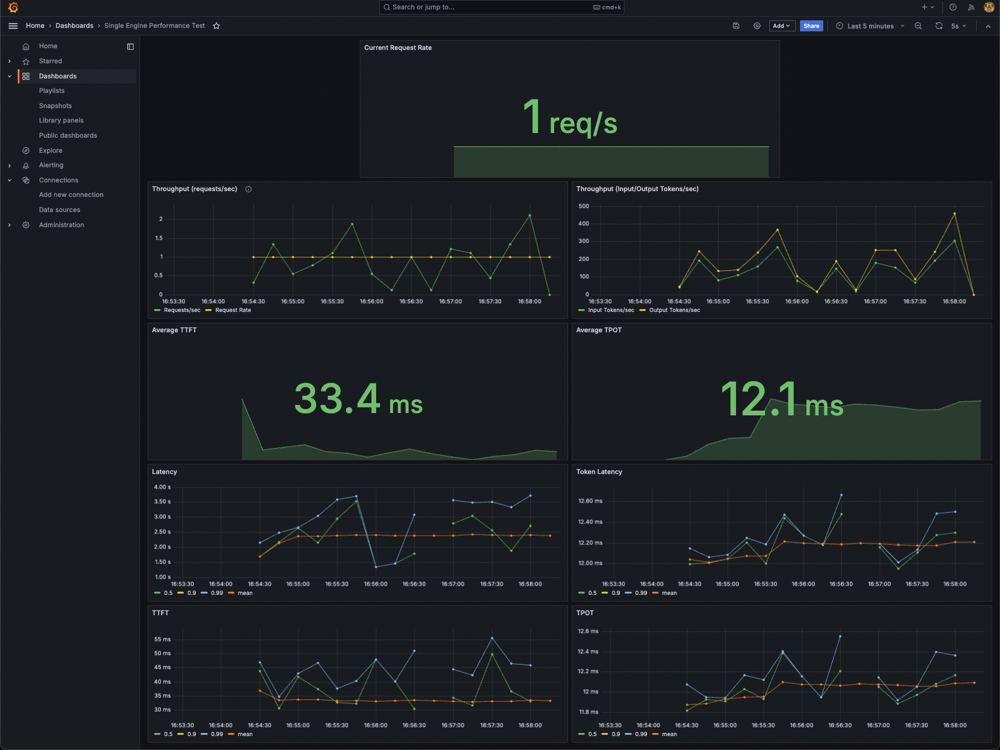

# LLMServingPerfEvaluator
A tool for evaluating the performance of LLM serving engines.

## Prerequisites
Make sure you have:
- [Docker Compose](https://docs.docker.com/compose/) installed
- A basic understanding of Docker and Docker Compose

## Performance Evaluation Overview
The evaluation workload sends concurrent inference requests, following a [Poisson distribution](https://en.wikipedia.org/wiki/Poisson_distribution) with a given **request rate (λ)**. The Poisson distribution is used for generating requests with the expectation of λ events in a given interval, meaning that the time interval between requests follows an exponential distribution with a mean of 1/λ. (i.e., greater λ values mean more requests are sent to the engine.)

A **workload** is generated by a given **workload_config.yaml**. [Here](./src/workload/README.md) are the details of the workload configuration format.

The following [metrics](#1-end-to-end-performance-metrics) are measured in the performance evaluation:
- Throughput (requests per second, input tokens per second, output tokens per second)
- Latency (seconds) / Token Latency (millisecond)
- Time to first token (millisecond, enabled with stream mode)
- Time per output tokens (millisecond, enabled with stream mode)

You can simply run the performance evaluation with the `docker-compose.yml` file in this repo. The `docker-compose.yml` file is already loaded with the `grafana` and `prometheus` containers, so you just simply access `http://localhost:3000` to monitor the live performance. Additionally, the end-to-end metrics are saved as a `.csv` file.



---
## Quick Start with Friendli Engine

In this quick start, we will evaluate the performance of the [Friendli Engine](https://suite.friendli.ai/signup/self-register?product=container).
The experiment will be conducted with the following configurations:
- Served Model: [meta-llama/Meta-Llama-3-8B-Instruct](https://huggingface.co/meta-llama/Meta-Llama-3-8B-Instruct)
- Hardware Requirement: NVIDIA Ampere or higher GPU with more than 32GB of GPU memory

### STEP 0. Clone the Repository
```bash
git clone https://github.com/friendliai/LLMServingPerfEvaluator.git
cd LLMServingPerfEvaluator
```

### STEP 1. Prepare working directory
```bash
mkdir -p workspace/config/request_config
mkdir -p workspace/config/workload_config
mkdir -p workspace/grafana
mkdir -p workspace/prometheus
```

### STEP 2. Set up the configuration files
In this quick start, we use the **<ins>following configuration files in this repository</ins>**:
- the workload config file in [`examples/workload_config/dummy.yaml`](./examples/workload_config/dummy.yaml)
- the request config file in [`examples/request_config/friendli.yaml`](./examples/request_config/friendli.yaml).

Also, we use the `grafana` and `prometheus` configuration files in this repository. Please copy [`grafana`](./grafana/) and [`prometheus`](./prometheus) directories in this repository to the `workspace` directory. (`grafana/provisioning/compare_engines_dashboard.json` does not need to be copied.)

```bash
cp examples/workload_config/dummy.yaml workspace/config/workload_config/
cp examples/request_config/friendli.yaml workspace/config/request_config/
cp -r grafana/ workspace/
cp -r prometheus/ workspace/
```


The `workspace` directory structure should look like this:
```bash
$ tree workspace/ -a
workspace
├── config
│    ├── request_config
│    │   └── friendli.yaml
│    └── workload_config
│        └── dummy.yaml
├── grafana
│   └──provisioning
│      ├── dashboards
│      │   ├── datshboard.yaml
│      │   └── single_engine_dashboard.json
│      └── datasources
│          └── datasource.yaml
└── prometheus
   └── config
      └── prometheus.yml
```

>[!NOTE]
> `workload_config.yaml`: Describes how to generate input-output pairs of requests in the experiment.
>
> Currently, two types of workloads are supported:
> - `dummy`: A synthetic input-output pair with a given length range.
> - `hf`: A input-output pair from Hugging Face dataset.
>
> For more details, please refer to the [document on generating workloads](./src/workload/README.md).

>[!NOTE]
> `request_config.yaml`: Builds the request body with the engine-specific format.
>
> In this quick start, we use the `Friendli Engine` request config below:
> ```yaml
> # request_config.yaml for Friendli Engine
> stream: True
> ```
> If `stream` is set to `True`, the engine will generate the output tokens one by one, and the `Time to first token` and `Time per output tokens` metrics are measured. If `stream` is set to `False`, the metrics are not measured.

> [!NOTE]
> You can use request_config example in `examples/request_config` for other engines.
>
> If you want to use another request body format, you can add your `RequestConfig` class in `src/engine_client` and write your own request config file.
> For more details, please refer to [section about adding custom `EngineClient`](#adding-a-custom-engine-client).


### STEP 3. Set up the `docker-compose.yml` and the `.env` file (or environment variables)
Copy the `docker-compose.yml` file in this repository to the `workspace` directory. Also, copy the `examples/docker_compose/.friendli_env` file in this repository to the `workspace` directory.
```bash
cp docker-compose.yml workspace/
cp examples/docker_compose/.friendli_env workspace/.env
```
When you open the `.env` file, there are environment variables for the experiment. The environment variables with braces should be replaced with the actual values.

```bash
# Experiment Environment Variables
HF_MODEL_NAME=meta-llama/Meta-Llama-3-8B-Instruct # The model repo id of the Hugging Face model
REQUEST_RATES=1,3,5,7 # The average number of requests per second
DURATION=300 # The duration of the experiment in seconds
TIMEOUT=450 # The timeout of the experiment in seconds
CONFIG_DIR=./config # The directory path to the configuration files: workload_config.yaml, request_config.yaml
RESULT_DIR=./result # The directory path to save the end-to-end metrics

# Experiment Environment Variables for the Hugging Face model
# HF_HUB_CACHE={HF_CACHE_DIR}
# HF_TOKEN={HF_API_TOKEN}

# user id by `id -u` in your host machine.
UID={UID}

# General Engine Environment Variables
FRIENDLI_CUDA_VISIBLE_DEVICES=0
FRIENDLI_NUM_DEVICES=1

# Friendli Engine Environment Variables.
FRIENDLI_CONTAINER_REPO=registry.friendli.ai/trial
FRIENDLI_CONTAINER_TAG=latest
FRIENDLI_CONTAINER_SECRET={FRIENDLI_CONTAINER_SECRET}

# Friendli Engine Environment Variables for MoE models or quantized models.
# POLICY_DIR={the directory path to the policy files}
```
For the `FRIENDLI_CONTAINER_SECRET`, please refer to the [Friendli Suite](https://suite.friendli.ai/team/VLsxT0IuydRd/container/quickstart) for more details.

> [!NOTE]
> If you want to run MoE models or quantized models, set the `POLICY_DIR` in the `.env` file. For more details of the `POLICY_DIR`, please refer [this document](https://docs.friendli.ai/guides/container/optimizing_inference_with_policy_search/#running-policy-search).

Now, the `workspace` directory structure should look like this:
```bash
$ tree workspace/ -a
workspace/
├── .env
├── config
│   ├── request_config
│   │   └── friendli.yaml
│   └── workload_config
│       └── dummy.yaml
├── docker-compose.yml
├── grafana
│   └── provisioning
│       ├── dashboards
│       │   ├── datshboard.yaml
│       │   └── single_engine_dashboard.json
│       └── datasources
│           └── datasource.yaml
└── prometheus
    └── config
        └── prometheus.yml
```

If you want to check whether the `docker-compose.yml` file is correctly set up with `.env` file, you can run the following command in the `workspace` directory:
```bash
docker compose config
```

> [!TIP]
> **Environment variables for the experiment: `DURATION`, `TIMEOUT`, and `REQUEST_RATE`**
>
> If the engine serves requests properly, the experiment at a certain `REQUEST_RATE` will finish approximately at a `DURATION` time. However, if the engine is overloaded, the experiment will take significantly longer than the `DURATION` time. In this case, you can set the `TIMEOUT` value to stop the experiment.
>
> To determine how many requests can be processed in a second with proper latency (~100 tokens/ms, which is faster than a typical person can read), you should try various `REQUEST_RATE` values.
>
> **DURATION**
>
> The `DURATION` should be long enough to collect sufficient samples for the performance evaluation. The default value of DURATION is 300 seconds, and we recommend using more than 300 seconds for performance evaluation.
>
> **TIMEOUT**
>
> When a experiment takes significantly longer than the `DURATION` time, you can set the `TIMEOUT` value to stop the experiment. We recommend setting the `TIMEOUT` value to 1.5 times the `DURATION` value. If the experiment finishes after the `TIMEOUT` value at a certain `REQUEST_RATE`, the experiments with larger `REQUEST_RATE` values will not be executed.
>
> **REQUEST_RATE(λ)**
>
> The `REQUEST_RATE` is the average number of requests per second, which is the expectation of the Poisson distribution. The time interval between requests follows an exponential distribution with a mean of 1/`REQUEST_RATE`. Therefore, the greater the `REQUEST_RATE` value, the more requests are sent to the engine.

>[!NOTE]
> **Hugging Face environment variables for the experiment:: `HF_HUB_CACHE` & `HF_TOKEN`**
> - `HF_HUB_CACHE`: The directory path to cache the Hugging Face model. If your host machine has a cache directory for the Hugging Face model, you can set the `HF_HUB_CACHE` environment variable to the directory path. If you want to other cache directory, you can override the `HF_HUB_CACHE` environment variable in the `.env` file.
> - `HF_TOKEN`: The Hugging Face API token to download the model from the Hugging Face hub.
> For more detail about the Hugging Face API token, please refer to [here](https://huggingface.co/docs/huggingface_hub/package_reference/environment_variables).


### STEP 4. Run the performance evaluation with Docker Compose
- Run the performance evaluation with the following command in the `workspace` directory:
```bash
cd workspace
docker compose up -d
```

### STEP 5. Check the performance metrics
Access `grafana` to monitor the live performance: http://localhost:3000.
>[!NOTE]
> - The default username and password are `admin` and `admin`.

### STEP 6. Exit the performance evaluation
- After the experiment, you can stop the performance evaluation with the following command:
```bash
docker compose down
```
- Check the end-to-end metrics in `{RESULT_DIR}` directory.

---
## Performance Evaluation on Different LLM Serving Engines
You can copy and modify the `{engine}-docker-compose.yml` file to run the performance evaluation on different serving engines.

Additionally, there are also `.{engine}_env` files for the different environment variables for the different serving engines.

> [!NOTE]
> In `examples/docker_compose`, there are `docker-compose.yml` files for the engines listed below:
> - [Friendli Engine](https://suite.friendli.ai/team/VLsxT0IuydRd/container/quickstart)
> - [vllm](https://github.com/vllm-project/vllm)

> [!TIP]
> For comparing the performance of the different engines, you can use `examples/docker_compose/compare-docker-compose.yml` file with `.compare_env` file.
> With `grafana/compare_engines_dashboard.json`, you can monitor the performance of the engines in the same dashboard.
> If you want to compare the performance of Friendli Engine and vLLM, please refer to our [blog post](https://friendli.ai/blog/llm-serving-perf-evaluator/)!

If you want to test other engines, you can add another `EngineClient` class in `src/engine_client` and write your own docker-compose file.

---
## Evaluation Results
### 1. End-to-end performance metrics
- Represents performance metrics for all of the requests, collected and calculated upon the termination of the experiment.
- The following metrics are measured:
    - Throughput: processed requests/tokens in a second
    - Latency: time taken to process a request
    - Token Latency: average time taken to process each output token of a request (i.e., latency / # of output tokens)
    - Time to first token: time taken to generate the first token of a request
    - Time per output tokens: average time taken between output tokens of a request
- For `Latency`, `Time to first token`, and `Time per output tokens`, the average, median, 95th percentile, and 99th percentile are calculated.
> [!NOTE]
> The end-to-end metrics are saved in `{RESULT_DIR}` directory.
> - '{engine_type}_{model_name}.conf' : experiment configuration file
> - '{engine_type}_{model_name}.csv' : end-to-end metrics file in csv format. You can easily analyze the results with this file using [pandas](https://pandas.pydata.org/pandas-docs/stable/user_guide/io.html#csv-text-files) or spreadsheet software.

### 2. Live performance metrics
- Monitor the current performance metrics in `grafana` **during the experiment**.
- The average of metrics is calculated by using responses up to now.
- The percentile of metrics are calculated by using responses which are collected in a time window (default=10s).

> [!NOTE]
> We use [prometheus-summary](https://github.com/RefaceAI/prometheus-summary) to calculate quantiles of metrics.
> If there are no responses collected in the time window, the percentile metrics are not calculated
> (i.e., there are empty values during the experiment on the dashboard).

>[!TIP]
> **Q. How to analyze the performance metrics?**
>
> If the engine can serve requests properly at a certain `REQUEST_RATE`, the throughput will follow the `REQUEST_RATE` value, and the latency will not increase.
> On the other hand, if the latency increases during the experiment, the engine is overloaded and can't serve the requests properly.
> Therefore, you can determine the maximum `REQUEST_RATE` value that the engine can serve properly by checking the throughput and latency metrics.

---
## LLMServingPerfEvaluator for Developers
If you wish to further develop the contents of this repository, please follow the instructions below.

### Install LLMServingPerfEvaluator
```bash
git clone https://github.com/friendliai/LLMServingPerfEvaluator.git
cd LLMServingPerfEvaluator
pip install -r requirements.txt
```

### Adding a Custom Engine Client
To run the performance evaluation with other engines, you can add your own `EngineClient` class in the `src/engine_client` directory. Also, you can add your own `RequestConfig` class in the same directory to build request body with the engine-specific format.

```python
from engine_client.base import EngineClient, RequestConfig, CompletionResult, RequestData

class CustomEngineRequestConfig(RequestConfig):
    """Request configuration for the engine."""

    # Add your own request configuration here
    # Currently, `RequestConfig` class has `stream` attributes for turning on/off stream mode.

class CustomEngineClient(EngineClient):
    """Engine client for the custom engine."""

    @property
    def request_url(self) -> str:
        """Inference URL of the engine."""
        return ...

    @property
    def health_url(self) -> str:
        """Health check URL of the engine."""
        return ...

    def build_request(self, data: RequestData) -> Dict[str, Any]:
        """Build request body with the engine-specific format."""
        return ...

```

### Run the Performance Evaluation on Custom Engines

**Step 1**. Set up the `.env` file (or environment variables) with the custom engine environment variables.

**Step 2**. Build the Docker image with the following command:
```bash
docker build -t friendliai/llm-serving-perf-evaluator:{tag} .
```
**Step 3**. Write the `docker-compose.yml` file with the custom engine.

**Step 4**. Run the performance evaluation with the following command:
```bash
# /path/to/directory/docker-compose.yml
docker compose up -d
```
**Step 5**. Check the performance metrics in `grafana` and the end-to-end metrics in `{RESULT_DIR}` directory.

**Step 6**. Exit the performance evaluation with the following command:
```bash
docker compose down
```
---
## Support & Issues
If you have any questions or issues, please feel free to [open an issue](https://github.com/friendliai/LLMServingPerfEvaluator/issues/new) in this repository.
